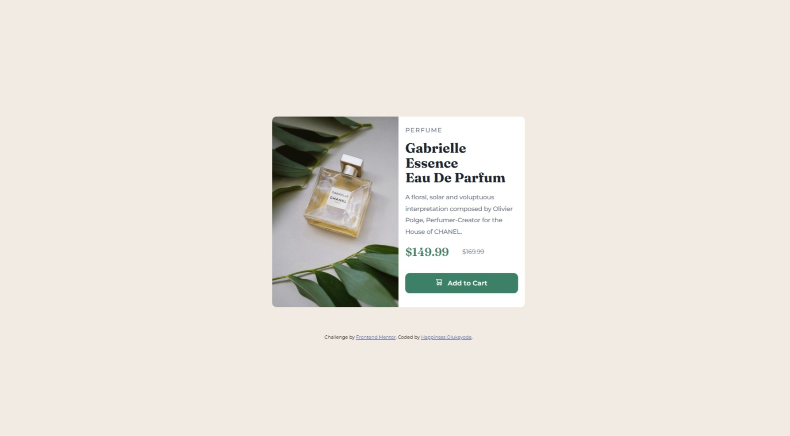

# Frontend Mentor - Product preview card component solution

This is a solution to the [Product preview card component challenge on Frontend Mentor](https://www.frontendmentor.io/challenges/product-preview-card-component-GO7UmttRfa). Frontend Mentor challenges help you improve your coding skills by building realistic projects.

## Table of contents

- [Overview](#overview)
  - [The challenge](#the-challenge)
  - [Screenshot](#screenshot)
  - [Links](#links)
- [My process](#my-process)
  - [Built with](#built-with)
  - [What I learned](#what-i-learned)
  - [Continued development](#continued-development)
  - [Useful resources](#useful-resources)
- [Author](#author)

## Overview

### The challenge

Users should be able to:

- View the optimal layout depending on their device's screen size
- See hover and focus states for interactive elements

### Screenshot

### Links

- Solution URL: [https://github.com/uptowngirl757/product-preview-card](https://github.com/uptowngirl757/product-preview-card)
- Live Site URL: [https://uptowngirl757.github.io/product-preview-card/](https://uptowngirl757.github.io/product-preview-card/)

## My process

### Built with

- Semantic HTML5 markup
- CSS custom properties
- Flexbox
- Mobile-first workflow

### What I learned

I used the mobile-first approach and SCSS for the first time, and I found it really awesome! I learned a lot during the process. The BEM naming convention pairs perfectly with SCSS, and I especially love how the `&` parent selector works so well in this context.

### Continued development

I really need to continue improving my SCSS skills, particularly with using mixins and other advanced features, to further enhance my development process.

### Useful resources

- [The web.dev course](https://web.dev/learn/design/picture-element?continue=https%3A%2F%2Fweb.dev%2Flearn%2Fdesign%23article-https%3A%2F%2Fweb.dev%2Flearn%2Fdesign%2Fpicture-elementm) - This resource was incredibly helpful in understanding responsive images, and it provided a very clear and detailed explanation

## Author

- Frontend Mentor - [@uptowngirl757](https://www.frontendmentor.io/profile/uptwongirl757)
